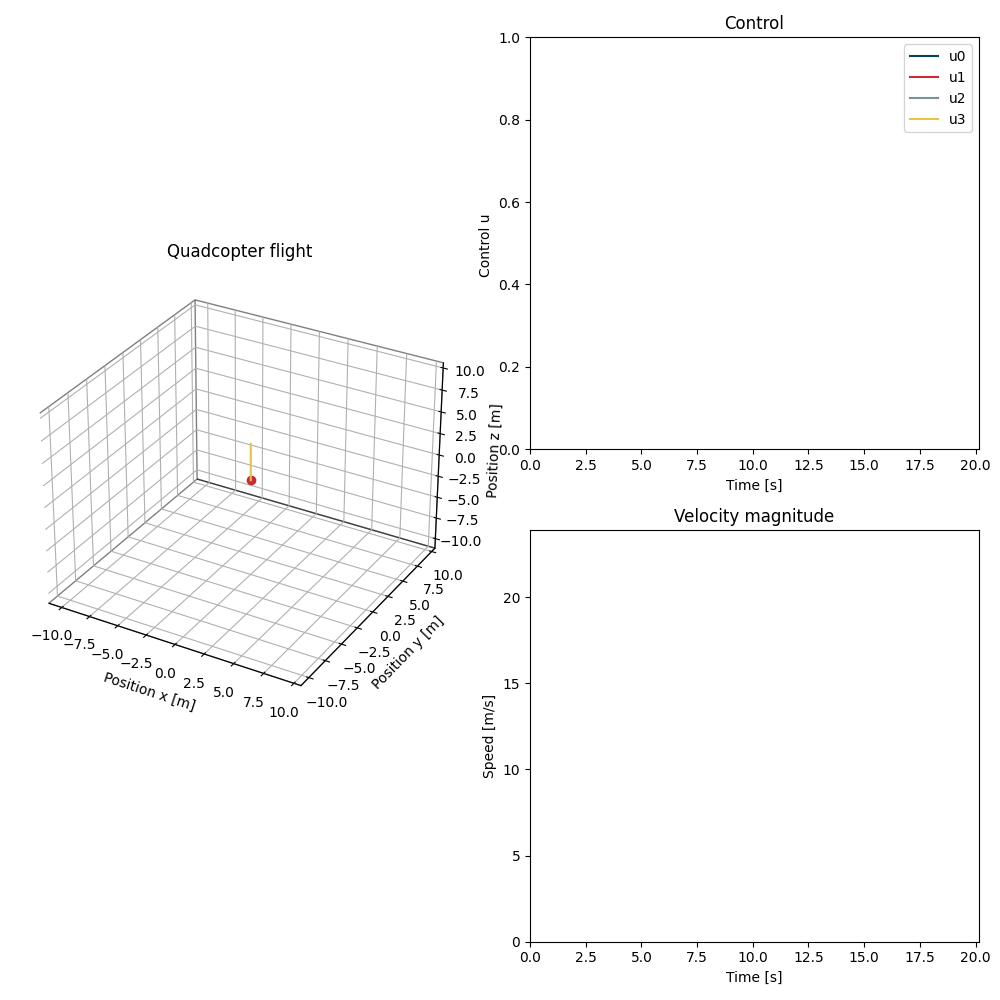

# Online Learning and Control for Data-Augmented Quadrotor Model
This repository contains the research code for our paper *Online Learning and Control for Data-Augmented Quadrotor Model*, pre-print available at https://arxiv.org/abs/2304.00503.

Using Gazebo, we control a quadcopter from the RotorS extension to track a desired trajectory under the presence of unknown air drag. Our solution attempts to fit a model of the air drag profile of the quadcopter *during* flight using recursive Gaussian process regression (RGP). This updated model is immedietly used to augment the first principle model optimized in MPC to find the next control action.

We estimate the air drag as the difference between the predicted and the measured velocity as

$$\tilde{\textbf{a}}^B_{k} = \frac{\textbf{v}^B_{k+1} - \hat{\textbf{v}}^B_{k+1}}{\Delta t_k}$$

which is used to update the RGP. The implementation of the RGP used can be found at https://github.com/smidmatej/RGP. 

The predictions of the recursive Gaussian process model allow us to make better predictions with the MPC controller, especially at higher velocities, where air resistance becomes more of a factor. Thus reducing the tracking error of the quadcopter to the desired trajectory.

The RGP model is initialized as without any information about the air drag profile of the quadrotor.

The RGP learns the air drag profile during flight, with no need to pretrain, an improves the flight control during training. 

Using a MPC controller augmented with the recursive Gaussian process, we are able to reach significantly higher speeds 

